### 无损压缩

- 减少像素间冗余

- 减少编码冗余

#### 变长编码

将最短的码字赋给概率最大的灰度级, 只减少编码冗余.

##### B编码

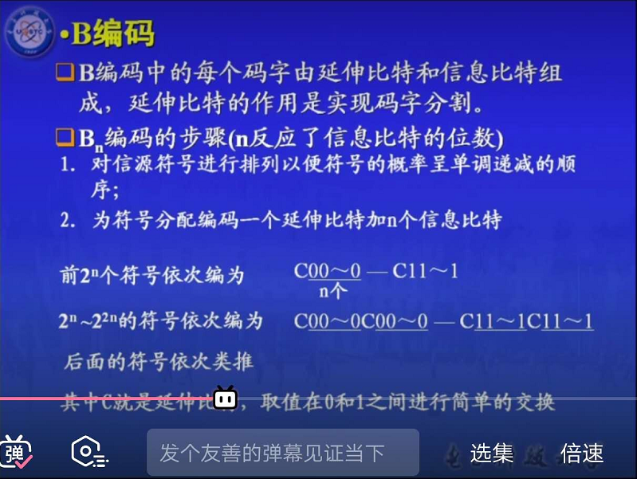


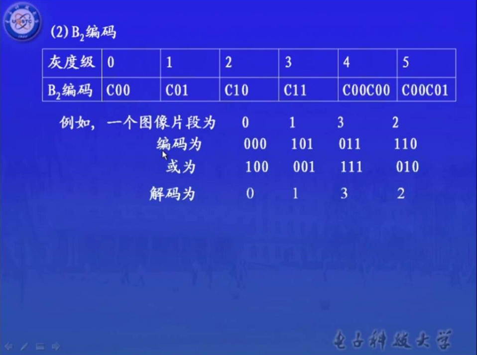

##### Huffman编码

当对信源符号逐个编码时, Huffman编码能给出最短的码字.


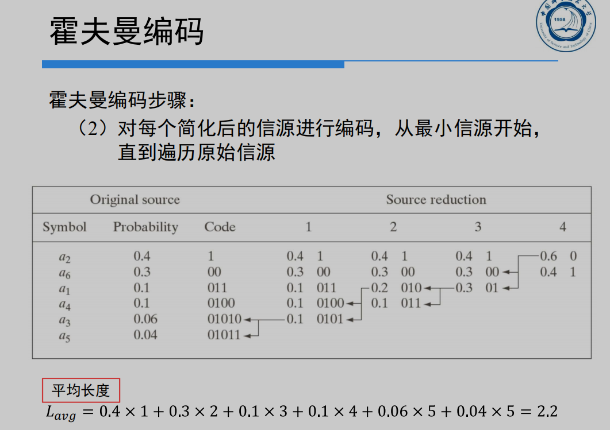

使用Huffman编码需要注意的问题:


Huffman编码的优化:


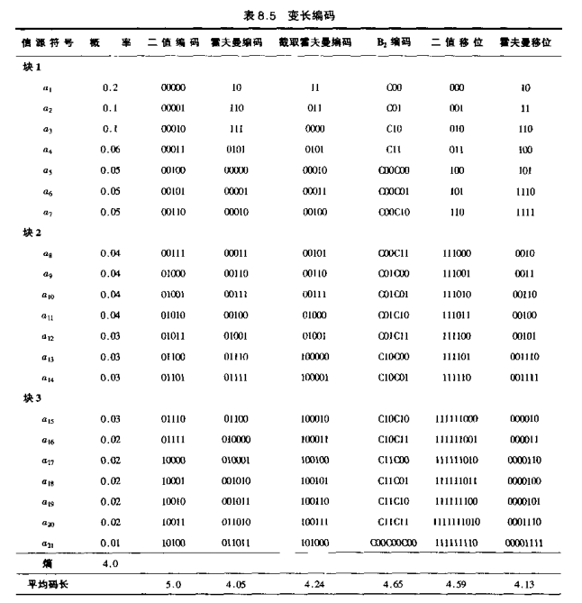

##### 移位码(S码)


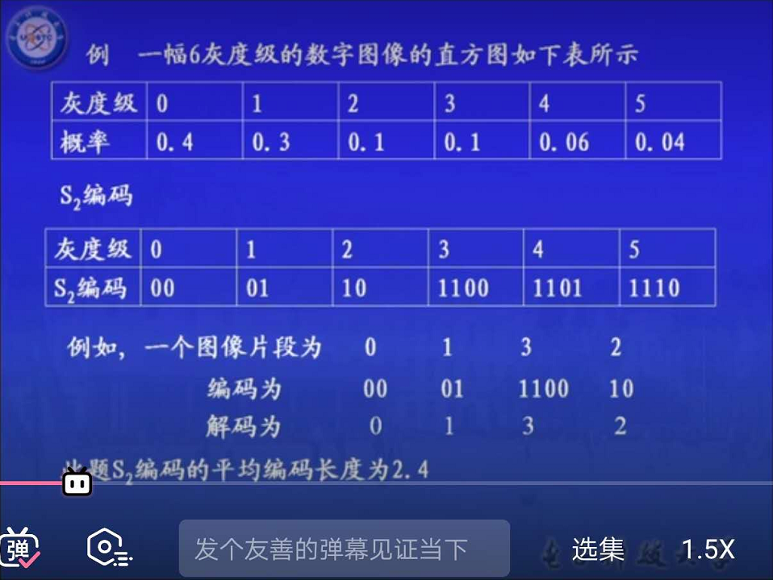

Huffman移位编码

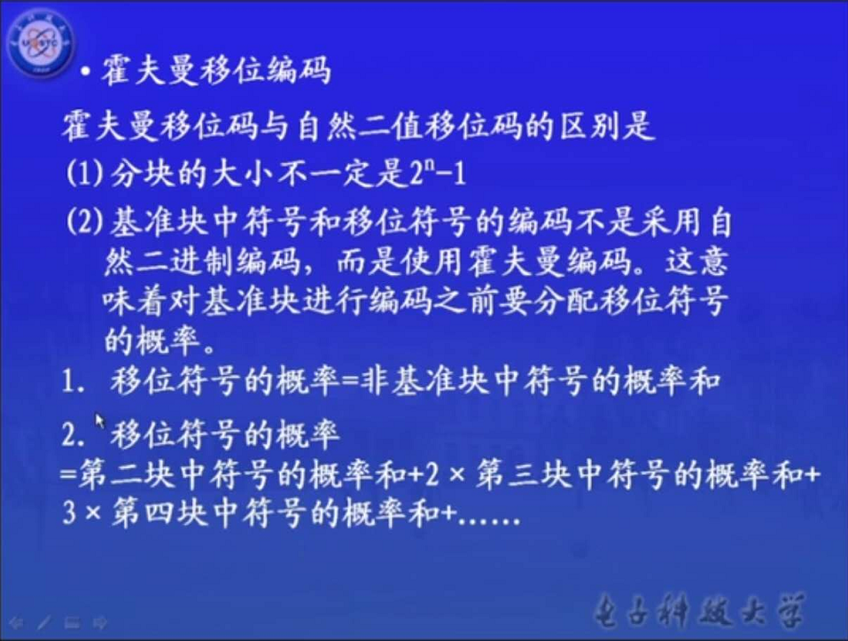

##### 算术编码

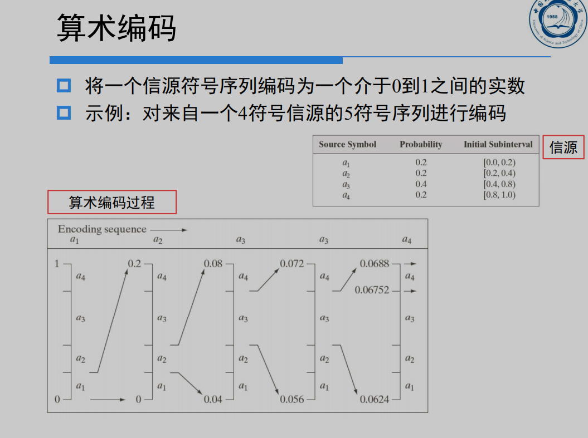

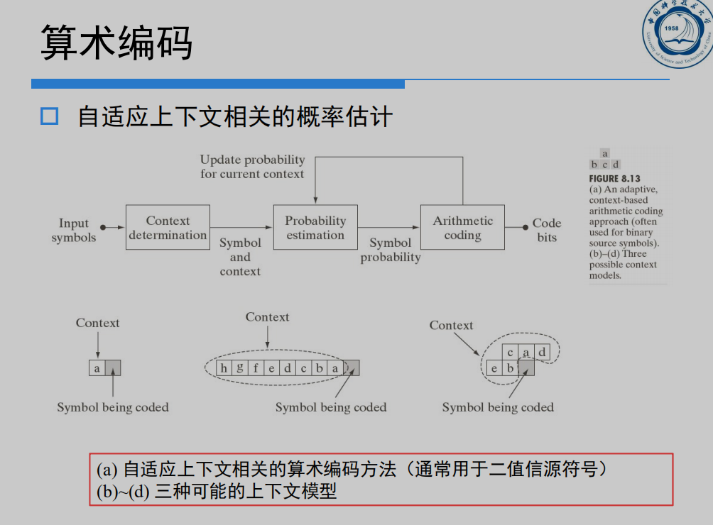

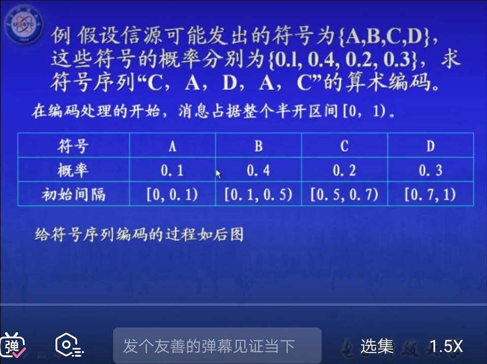

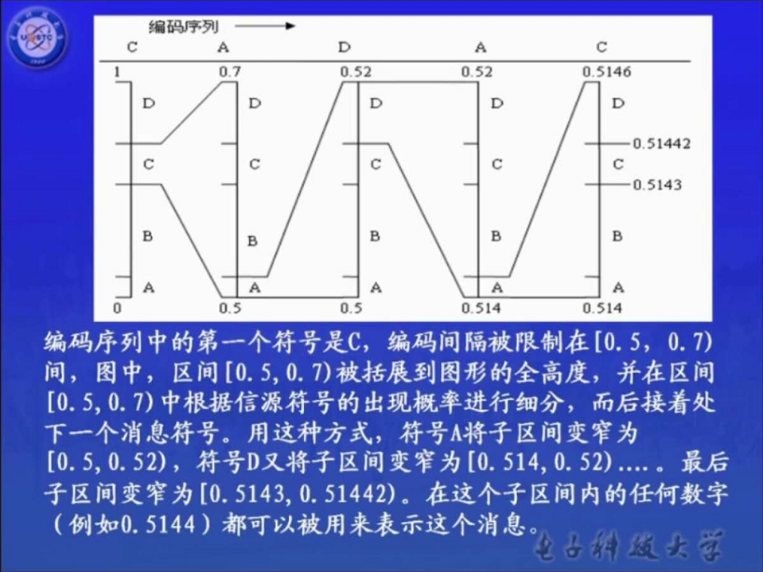

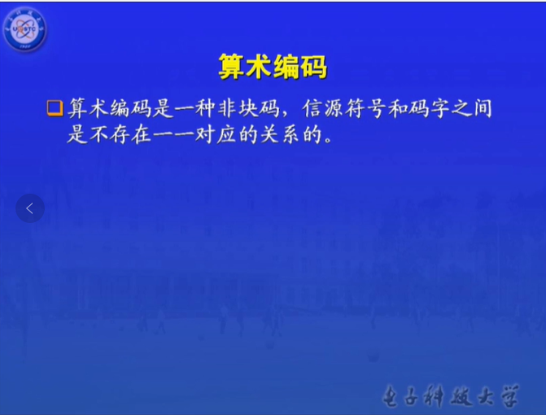

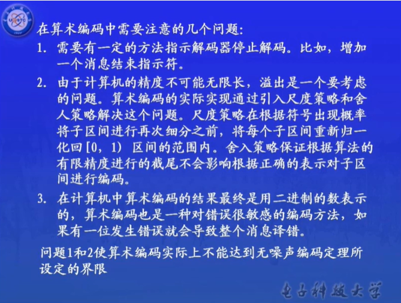

##### 词典编码(LZW编码)

LZW全称Lempel-Ziv-Welch, 就是这三个人搞出来的算法.

LZW的工作思路: 考虑一段数据, `abcabcabc`, 对于这样的一段数据, 如果不做任何处理和压缩, 假设每个字符用一个字节来表示, 直接存储的空间应
该是9字节. 详细说明如下:

下表是我们的dictionary, 也就是码表, 字符与编码的对应.


观察上面的字符串, 发现abc是重复的, 如果abc能够用一个字节来表示的话, 那么, 只需要3个字节存储就足够了.


上述就是LZW的基本思想.

**Encoding基本思想**

编码的基本思想是这样的: 首先我们有一个码表或者称为dictionary, 里面只定义单个字符和编码, 比如0-9a-zA-Z这些, 其实ASCII码中的所有都放进
去都可以.

也就是说通常用十进制数0-255来表示单一字符(single character).

然后我们开始读取字符串, 很显然对于任何常规字符串, 每个single character都可以得到一个码字, 但是如果我们不做处理的话, 那么n个字符
encode后, 就是n个码字了完全没有压缩.

所以, 在一边读取的时候, 一边开始对dictionary进行扩增, 不断地将single character拼接成dictionary中不存在的符号(symbol), 扩充
dictionary, 这样下次再次遇到这样的组合, 就可以使用有一个码字表示了.

**Encoding流程**

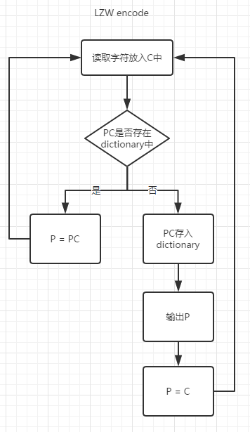

```
P ---> Previous ---> 表示之前的字符
C ---> Current ---> 表示当前读取的字符
```

然后我们考虑字符串`abcbcabcabcd`

按步骤演算一下:

首先我们需要一个dictionary, 简单考虑, 只考虑a-d, 4个英文小写字母. **这里想表达的意思是, 整个宇宙全世界只有a-d4个英文字母, 我们的
ascii表中也只有 4 个字母**.


下面是演算过程: 
注意下面dictionary中的冒号后面的数字, 表示的新的ascii码, 啥意思呢? 上面说了, 全世界只有a-d4个字母, 码表是1-4, 接下来我们要将ab两
个字母连在一起作为一个整体, 用5来给它编码, 因此就是ab:5

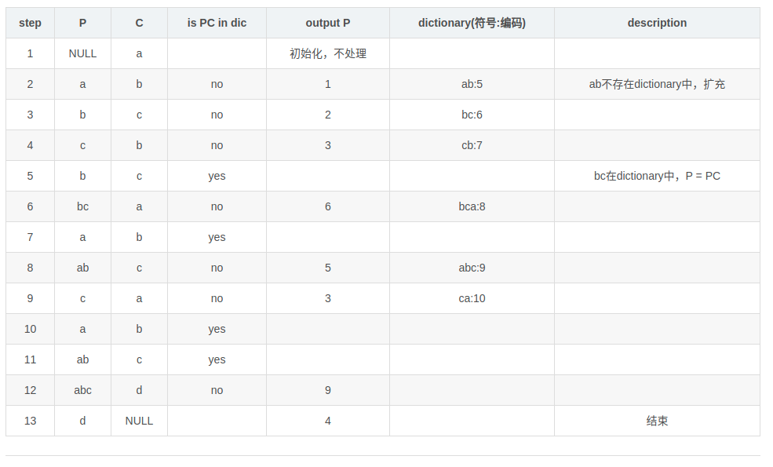

经过上面的演算过程, 我们的dictionary也扩展为:

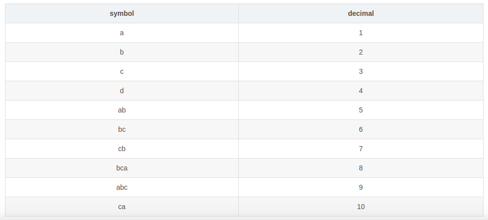


**Decoding 主要思想**
解码的主要思想是: 一个编码序列, 我们也是事先知道一个固定的码表, 我以便读取码字, 一边输出解码后的字符, 同时一边扩充
码表.

**Decoding 流程**

同样的, 这里给出一个编码序列:

```
[1, 2, 3, 257, 256, 3, 260, 4]
```

首先我们需要一个默认的dictionary:

|  decimal  | symbol  |
|  :----:   | :----:  |
|     1     |    a    |
|     2     |    b    |
|     3     |    c    |
|     4     |    d    |

接下来是演算过程:

| Input|   P  |   C  | P+C[0] in dic? | output | dictionary | description |
|:----:|:----:|:----:|:----:|:----:|:----:|:----:|
|  1   | NULL |  a   |  yes |  a   |      |      |
|  2   | a    |  b   |  no  |  b   |  ab:256    |  ab不在dictionary中, 扩充  |
|  3   | b    |  c   |  no |   c   |  bc:257    |  bc不在dictionary中, 扩充  |
| 257  | c    |  bc  |  no |   bc  |  cb:258    |  cb不在dictionary中, 扩充  |
| 256  | bc   |  ab  |  no |   ab  |  bca:259   |  bca不在dictionary中, 扩充 |
|  3   | ab   |  c   |  no |   c   |  abc:260   |  abc不在dictionary中, 扩充 |
|  260 | c    |  abc |  no |  abc  |  ca:261    |  ca不在dictionary中, 扩充  |
|  4   | abc  |  d   |  no |   d   |  abcd:262  |  abcd不在dictionary中, 扩充 |

因此输出为:

```
abcbcabcabcd
```


